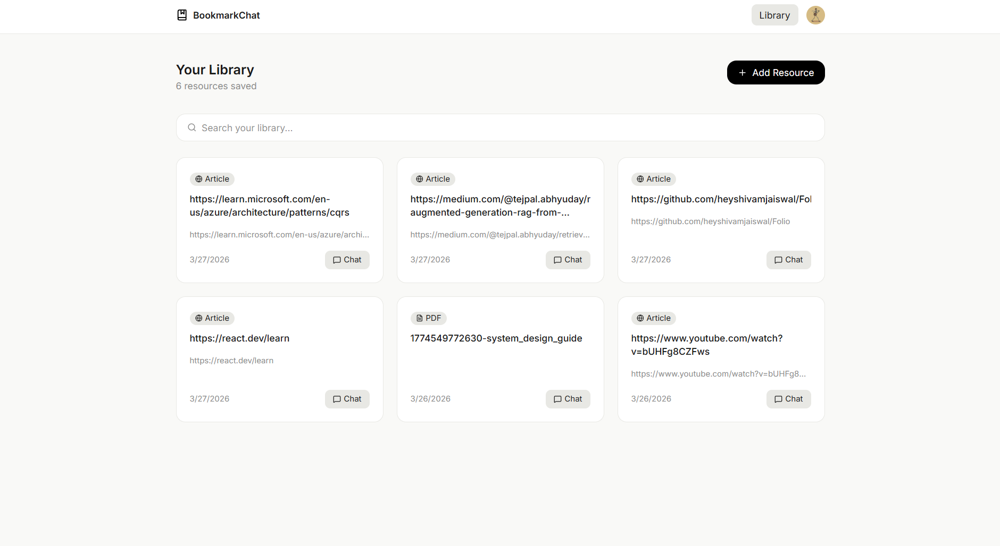
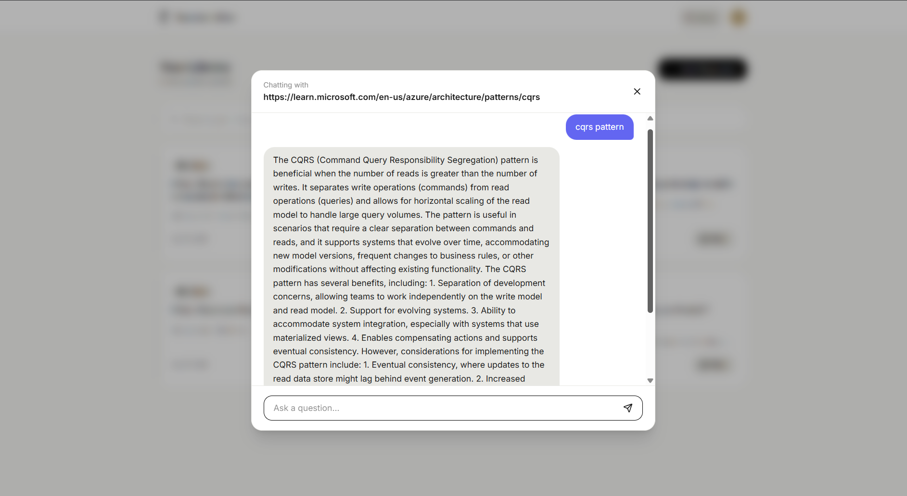

<div align="center">

# Folio

### Save anything. Ask anything. Understand everything.

**Folio** is a RAG-powered (Retrieval-Augmented Generation) personal knowledge library.  
Save articles, YouTube videos, PDFs, and raw text — then have real AI conversations with that content.  
No more saving links you never read. Just ask.

[](https://folio-blond-delta.vercel.app)
[](https://github.com/heyshivamjaiswal/Folio)
[](https://www.typescriptlang.org)

</div>

---

## 📸 Screenshots

### Library — Your Saved Resources
> 

### Chat — Talk to Your Content
> 

---

##  What is Folio?

Most people save links and never revisit them. Folio fixes that by letting you **have a conversation with everything you save**.

Paste a URL, drop a YouTube link, upload a PDF, or type raw text. Folio scrapes it, cleans it, chunks it, embeds it into a vector space, and stores it. The next time you open that resource and ask a question — Folio retrieves the most relevant parts of that content and sends them to an LLM to generate a precise, grounded answer.

This is **RAG — Retrieval-Augmented Generation** — and it's the core of how Folio works.

---

##  Tech Stack

| Layer | Technology |
|---|---|
| Frontend | React + TypeScript + Tailwind CSS + shadcn/ui |
| Backend | Node.js + Express + TypeScript |
| Database | PostgreSQL via Prisma ORM |
| Vector Store | Pinecone |
| Embeddings | LangChain Embeddings (384 dimensions) |
| LLM | OpenAI / LangChain LLM |
| PDF Parsing | pdf-parse |
| Web Scraping | Axios + Mozilla Readability + Cheerio |
| YouTube | youtube-transcript |
| Deployment | Vercel (Frontend) |

---

##  The RAG System — How It All Works

This is the heart of Folio. Every piece of saved content goes through a multi-stage pipeline before it can be queried. Here's exactly how it works.

---

### Stage 1 — Source Detection

When a user adds a resource, the first step is figuring out what kind of content it is.

```
detectSource(input)
  ├── youtube.com / youtu.be  →  "youtube"
  ├── input.includes(".pdf")  →  "pdf"
  ├── starts with "http"      →  "web"
  └── everything else         →  "text"
```

This happens automatically — the user never has to pick a type. They paste, Folio figures it out.

---

### Stage 2 — Content Loading

Based on the detected source type, the appropriate loader is called:

```
loadContent(input)
  ├── "web"     →  scrapeArticle()      — Axios fetch → Readability → Cheerio fallback
  ├── "pdf"     →  loadPDF()            — Axios (arraybuffer) → pdf-parse
  ├── "youtube" →  loadYouTubeTranscript() — youtube-transcript API → joined text
  └── "text"    →  { title: "Text", text: input }
```

**Web scraping** has a retry mechanism (3 attempts) and uses Mozilla's Readability for clean article extraction, falling back to Cheerio paragraph extraction if Readability fails. If the extracted content is under 400 characters, the ingestion fails fast with an error — no garbage data enters the pipeline.

---

### Stage 3 — Text Cleaning

Raw scraped or extracted text is messy — extra whitespace, special characters, newlines everywhere. `cleanText()` normalises the content before it gets chunked.

---

### Stage 4 — Chunking

Long documents can't be sent to an embedding model all at once — they'd exceed token limits and lose semantic precision. `chunkTexts()` splits the cleaned text into overlapping chunks.

Each chunk is a semantically meaningful slice of the original document, small enough to embed accurately but large enough to carry context.

---

### Stage 5 — Embedding

Each chunk is converted into a **384-dimensional vector** using LangChain's embedding model.

```
embedDocuments(chunks) → float[][] (one vector per chunk)
```

A vector is a list of numbers that represents the *meaning* of a piece of text in high-dimensional space. Chunks that mean similar things end up close together. This is what makes semantic search possible.

---

### Stage 6 — Storing in Pinecone

Each vector is stored in Pinecone alongside metadata that ties it back to the original bookmark.

```typescript
{
  id: `${bookmarkId}-${timestamp}-${i}`,   // unique, no collision on re-ingestion
  values: vector,                           // the 384-dim embedding
  metadata: {
    bookmarkId,                             // which bookmark this chunk belongs to
    userId,                                 // who owns it
    text: chunk                             // the raw text for context retrieval
  }
}
```

Records are stored inside `namespace(userId)` — every user's data is completely isolated in their own namespace. The `bookmarkId` in metadata allows filtering to a single resource at query time.

---

### Stage 7 — Querying (RAG in Action)

When a user asks a question in the chat interface, this is what happens:

```
User question
    │
    ▼
embedQuery(question)          ← embed the question into the same vector space
    │
    ▼
index.namespace(userId).query({
  vector: questionVector,
  topK: 5,                    ← retrieve the 5 most semantically similar chunks
  filter: { bookmarkId }      ← scoped to the specific bookmark being chatted with
})
    │
    ▼
buildContext(matches)         ← extract text from matched chunks, collect source URLs
    │
    ▼
askLLM(context, question)     ← send context + question to LLM, get grounded answer
    │
    ▼
{ answer, sources }           ← returned to the user
```

The LLM never hallucinates about things not in the document — it can only answer using the retrieved chunks. This is the core promise of RAG.

---

### Full Ingestion Pipeline (Visual)

```
User Input (URL / Text / YouTube / PDF)
          │
          ▼
    detectSource()
          │
          ▼
    loadContent()
    ├── scrapeArticle()
    ├── loadPDF()
    ├── loadYouTubeTranscript()
    └── raw text
          │
          ▼
     cleanText()
          │
          ▼
     chunkTexts()
          │
          ▼
  embedDocuments()  ──→  384-dim vectors
          │
          ▼
   storeChunk()  ──→  Pinecone namespace(userId)
                       metadata: { bookmarkId, userId, text }
```

---

### Two Databases, One Purpose

Folio uses two completely separate databases that work together:

**PostgreSQL (via Prisma)**
Stores structured bookmark records — id, userId, url, title, type, createdAt. This powers the library page and bookmark listing.

**Pinecone**
Stores vector embeddings for semantic search. Organised by user namespace, filtered by bookmarkId.

They're linked by a single value — `bookmarkId`. PostgreSQL creates it, Pinecone stores it in metadata. At query time, both work together: PostgreSQL provides the title and display data, Pinecone provides the answer.

---

## 🗂️ Project Structure

```
├── server/
│   ├── controllers/
│   │   ├── bookmark.controller.ts     # addBookmark, listBookmark
│   │   ├── chat.controller.ts         # chatWithBookmark
│   │   └── pdf.controller.ts          # uploadPDF
│   ├── routes/
│   │   ├── bookmark.routes.ts
│   │   ├── chat.routes.ts
│   │   └── pdf.route.ts
│   ├── services/
│   │   ├── contentLoader.ts           # orchestrates source detection + loading
│   │   ├── searchChunks.ts            # Pinecone semantic search
│   │   ├── buildcontext.ts            # assembles context from matches
│   │   ├── pdf.services.ts            # PDF parsing
│   │   ├── scrape.services.ts         # web scraping
│   │   ├── youtube.service.ts         # YouTube transcript
│   │   └── pipeline/
│   │       ├── processBookmark.ts     # full ingestion pipeline
│   │       └── pdfProcess.ts          # PDF-specific ingestion
│   ├── vector/
│   │   ├── pinecone.ts                # Pinecone client + index
│   │   ├── storeChunk.ts              # upsert vectors
│   │   └── createVectorDBIndex.ts     # index initialisation on startup
│   ├── embeddings/
│   │   └── embed.ts                   # LangChain embedding model
│   ├── llm/
│   │   └── generateAnswer.ts          # LLM call with context
│   ├── chunk/
│   │   └── chunkText.ts               # text chunking logic
│   ├── utils/
│   │   ├── cleanText.ts
│   │   └── upload.ts                  # multer config
│   └── db/
│       └── prisma.ts
│
└── client/
    ├── src/
    │   ├── api/
    │   │   └── index.ts               # all API calls centralised here
    │   ├── components/
    │   │   ├── ui/
    │   │   │   ├── BookmarkCard.tsx
    │   │   │   ├── AddBookmarkModal.tsx
    │   │   │   ├── SearchBar.tsx
    │   │   │   ├── MessageBubble.tsx
    │   │   │   └── Navbar.tsx
    │   │   └── ChatBox.tsx
    │   ├── pages/
    │   │   └── BookmarksPage.tsx
    │   └── tpes/
    │       └── index.ts               # shared TypeScript types
```

---

## 🔌 API Endpoints

```
POST   /api/bookmarks          Add a bookmark (article / YouTube / text)
GET    /api/bookmarks?userId=  List all bookmarks for a user
POST   /api/upload-pdf         Upload a PDF file (multipart/form-data)
POST   /api/chat               Chat with a specific bookmark
```

### Request Bodies

```typescript
// POST /api/bookmarks
{ userId: string, url: string, title?: string, type?: string }

// POST /api/upload-pdf
FormData: { file: File, userId: string }

// POST /api/chat
{ userId: string, bookmarkId: number, question: string }
```

---

##  Running Locally

### Prerequisites

- Node.js 18+
- PostgreSQL
- Pinecone account
- OpenAI API key

### Backend

```bash
cd server
npm install
cp .env.example .env
# Fill in DATABASE_URL, PINECONE_API_KEY, PINECONE_INDEX, OPENAI_API_KEY
npx prisma migrate dev
npm run dev
```

### Frontend

```bash
cd client
npm install
cp .env.example .env
# Set VITE_API_URL=http://localhost:3000/api
npm run dev
```

---

## ⚙️ Environment Variables

```env
# Server
DATABASE_URL=
PINECONE_API_KEY=
PINECONE_INDEX=
OPENAI_API_KEY=
PORT=3000

# Client
VITE_API_URL=http://localhost:3000/api
```

---

##  Key Design Decisions

**Why Pinecone over pgvector?**
Pinecone is purpose-built for vector search with native ANN indexing, filtering, and namespace isolation out of the box. pgvector works but requires manual tuning at scale. For a project centred on semantic search, a dedicated vector database was the cleaner choice.

**Why namespace by userId?**
Pinecone namespaces provide hard data isolation between users without any filter overhead. Each user's vectors live in their own partition — there's no risk of cross-user data leakage and queries are faster.

**Why fire ingestion in the background?**
Scraping, chunking, and embedding can take several seconds especially for long articles. Running `processBookmarks()` without `await` lets the API respond immediately after saving to PostgreSQL, while ingestion completes in the background. No queues, no workers — simple and effective for this scale.

**One input for all content types**
Source detection is automatic. Users paste anything — a URL, YouTube link, or plain text — and Folio figures out what it is. PDF upload is the only exception since it requires a file picker, so it sits alongside the input as a secondary option.

---

## 📄 License

MIT

---

<div align="center">
  Built with curiosity by <a href="https://github.com/heyshivamjaiswal">Shivam Jaiswal</a>
</div>
