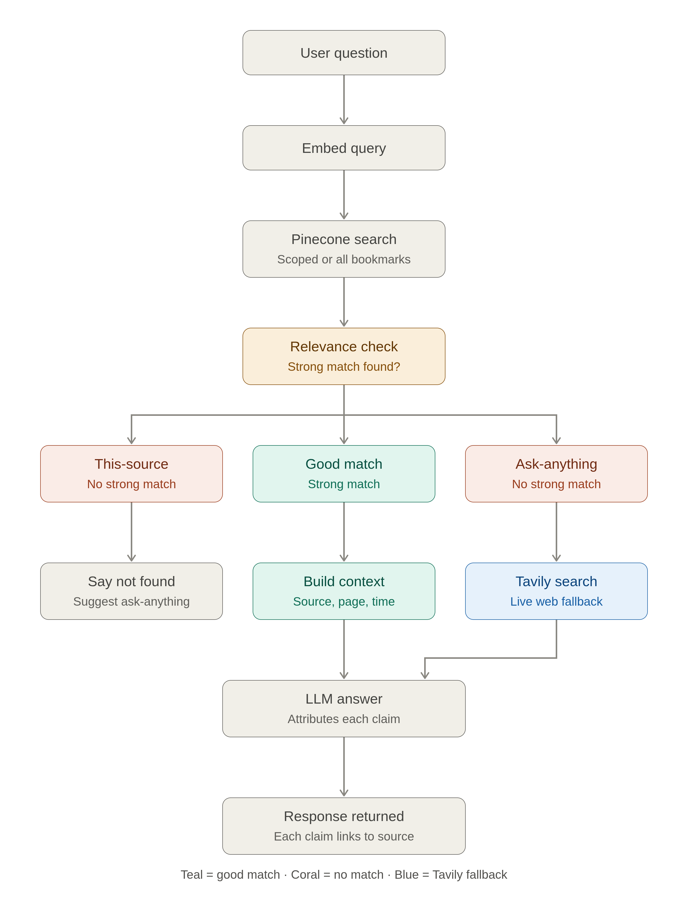

<div align="center">

# Folio

### Every answer, traced to the line it came from.

**Folio** is a source-verified RAG (Retrieval-Augmented Generation) knowledge tool.
Save PDFs, articles, and YouTube videos  then ask questions and get answers with
exact citations: the page number, the timestamp, the paragraph. Not just "trust me."

[](https://folio-blond-delta.vercel.app)
[](https://github.com/heyshivamjaiswal/Folio)
[](https://folio-kdur.onrender.com)
[](https://www.typescriptlang.org)

</div>

---

## What Folio actually does differently

Most RAG demos look the same: upload a document, ask a question, get an answer, hope it's right. Folio is built around one specific idea  **an answer is only useful if you can check it**  and that shapes every design decision below.

- **Real citations, not vibes.** Every claim links to the PDF page, the video timestamp, or the article it came from — clickable, not just labeled.
- **It tells you when it's guessing.** If your saved content doesn't have a good answer, Folio doesn't quietly blend in general knowledge. It falls back to a live web search only in "Ask Anything" mode, and says so explicitly in the answer.
- **It admits when it doesn't know.** Ask a narrow question about one source and Folio can't find it? You get told plainly, with a prompt to broaden the search  not a hallucinated guess.
- **Cross-source conflict awareness.** If two saved sources disagree, the model is instructed to surface that disagreement instead of silently picking one.

---

## Tech Stack

| Layer | Technology |
|---|---|
| Frontend | React 19 + TypeScript + Vite + Tailwind CSS v4 |
| Auth | Clerk |
| Backend | Node.js + Express 5 + TypeScript |
| Database | PostgreSQL (Neon) via Prisma ORM |
| File Storage | Supabase Storage (PDFs) |
| Vector Store | Pinecone (namespaced per user) |
| Embeddings | HuggingFace Inference (`sentence-transformers/all-MiniLM-L6-v2`) |
| LLM | Groq (`llama-3.3-70b-versatile`) via LangChain |
| PDF Parsing | pdfjs-dist |
| Web Scraping | Axios + Mozilla Readability + Cheerio, with retry/backoff |
| YouTube | LangChain `YoutubeLoader` + segment-level timestamps |
| Web Search Fallback | Tavily |
| Deployment | Vercel (frontend) + Render (backend) |

---

## How it works

### Ingestion

Every source — a PDF upload, a pasted link, a YouTube URL — goes through the same shape of pipeline, but each type preserves its own structural metadata instead of flattening everything into one undifferentiated blob of text:

```
Input
  │
  ▼
detectSource() → "pdf" | "web" | "youtube" | "text"
  │
  ▼
loadContent()
  ├── PDF     → extracted per-page, so page numbers survive into chunking
  ├── Web     → Readability-first scrape, Cheerio fallback, retry with backoff
  └── YouTube → LangChain YoutubeLoader + per-segment timestamps
  │
  ▼
cleanText() — normalizes whitespace, preserves paragraph structure
  │
  ▼
chunkTexts() — overlapping chunks, page/timestamp tagged per chunk
  │
  ▼
embedDocuments() — 384-dim vectors (HuggingFace)
  │
  ▼
storeChunk() — Pinecone, namespace(userId), metadata: {
  sourceType, sourceUrl, page?, startSeconds?, chunkIndex
}
```

Every bookmark also tracks a real ingestion **status** (`pending` → `processing` → `ready`/`failed`), with the failure reason surfaced in the UI  not a silent dead entry that looks saved but never resolves.

### Retrieval and answering

Two modes, deliberately different in behavior, not just UI framing:

```
Question
  │
  ▼
embedQuery()
  │
  ▼
Pinecone search (scoped to one bookmark, or across all of them)
  │
  ▼
relevance check — good match? or fall back?
  │
  ├─ This-source, no match  → "not found in this source" + suggest Ask Anything
  ├─ Ask-anything, no match → live web search, clearly labeled in the answer
  └─ good match             → build labeled context blocks (source + page/timestamp)
  │
  ▼
LLM answer — instructed to attribute every claim to its source,
flag web-fallback content, and surface disagreements
between sources rather than picking one silently
  │
  ▼
{ answer, sources[] } — each source carries a real link:
deep-linked YouTube timestamp, direct article URL,
or a signed URL fetched on demand for private PDFs
```

**This source** — scoped to one saved bookmark. If the retrieved content isn't a strong enough match for the question, Folio says so directly and never falls back to the open web. The scope is a promise: an answer here only ever comes from what you saved.

**Ask anything** — searches across every saved source at once. If nothing saved is a strong match, it falls back to a live web search (Tavily)  and the resulting answer explicitly flags which parts came from your content versus the open web.

### RAG pipeline, with the Tavily fallback

The diagram below is the same flow as above, redrawn to make the fallback branch explicit  this is the part that keeps Folio from quietly turning into "just ask the model."



The key design choice sits in the top fork: **this-source mode never touches the fallback branch at all.** A no-match there is a dead end by design  Folio tells you plainly and stops, rather than quietly widening the search. Only **ask-anything mode** is allowed to reach for Tavily, and when it does, the LLM is explicitly prompted to label which parts of the answer came from your saved sources versus the open web.

### Two databases, one purpose

**PostgreSQL (Prisma)** — structured bookmark records: title, type, status, storage path, error messages. Powers the library view and lifecycle tracking.

**Pinecone** — the actual semantic memory. Namespaced per user (`namespace(userId)`), so one user's data is never reachable by another's queries, with no extra filtering logic required.

They're linked by `bookmarkId` — Postgres creates it, Pinecone metadata carries it, and citations join the two back together at query time (a chunk's `bookmarkId` resolves to the source's real title for display).

---

## Project Structure

```
server/
├── controllers/          bookmark, chat, pdf route handlers
├── routes/                express route wiring
├── services/
│   ├── contentLoader.ts   source-type dispatch
│   ├── pdf.services.ts    per-page PDF extraction
│   ├── scrape.services.ts web scraping w/ retry
│   ├── youtube.service.ts LangChain loader + timestamps
│   ├── buildcontext.ts    assembles labeled context + citations
│   ├── sourceLink.ts      builds clickable citation links
│   ├── agent/
│   │   ├── answerQuestion.ts  narrow vs ask-anything orchestration
│   │   └── relevance.ts       retrieval-sufficiency threshold
│   ├── tools/webSearchTool.ts Tavily fallback
│   ├── storage/supabaseStorage.ts PDF upload/delete/signed URLs
│   └── pipeline/          full ingestion pipelines (PDF / bookmark)
├── vector/                Pinecone client, index setup, chunk storage
├── embeddings/            HuggingFace embedding client
├── llm/                   Groq client + prompt construction
└── db/                    Prisma + Supabase clients

client/
├── src/
│   ├── api/               centralized fetch wrappers
│   ├── components/        BookmarkCard, ChatBox, SourceChip, ModeToggle, etc.
│   ├── pages/              LandingPage, BookmarksPage
│   ├── store/              Zustand bookmark store
│   ├── theme/               light/dark theme provider
│   └── type.ts              shared TypeScript types
```

---

## API Endpoints

| Method | Endpoint | Description |
|---|---|---|
| `POST` | `/api/bookmarks` | Add a bookmark (article or YouTube link) |
| `GET` | `/api/bookmarks` | List bookmarks (paginated) |
| `GET` | `/api/bookmarks/:id` | Get a single bookmark |
| `DELETE` | `/api/bookmarks/:id` | Delete a bookmark (cascades to Pinecone + Supabase) |
| `GET` | `/api/bookmarks/:id/pdf-url` | Get a signed URL for a stored PDF |
| `POST` | `/api/upload-pdf` | Upload a PDF (multipart/form-data) |
| `POST` | `/api/chat` | Ask a question — narrow or ask-anything mode |

All routes are authenticated via Clerk; user identity comes from the session token, not request bodies.

---

## Running Locally

### Prerequisites

- Node.js 20+
- A Neon (or any Postgres) database
- Pinecone, Clerk, Supabase, HuggingFace, Groq, and Tavily accounts (all have usable free tiers)

### Backend

```bash
cd server
npm install
cp .env.example .env   # fill in DATABASE_URL, CLERK_*, PINECONE_*, HF_API_KEY, GROQ_API_KEY, SUPABASE_*, TAVILY_API_KEY
npx prisma generate
npm run dev
```

### Frontend

```bash
cd client
npm install
cp .env.example .env   # VITE_CLERK_PUBLISHABLE_KEY, VITE_API_URL=http://localhost:3000/api
npm run dev
```

---

## Key Design Decisions

**Why two chat modes instead of one?**
Blending "answer from my documents" and "answer from the web" into one undifferentiated mode is how most RAG tools quietly become just a worse search engine. Keeping them separate — and making the fallback explicit when it happens — is a small design choice that changes what the product can honestly claim.

**Why track ingestion status instead of fire-and-forget?**
Scraping and embedding take real time, and can fail — a dead link, a paywalled article, disabled captions. A bookmark that silently sits there with zero chunks and no explanation is worse than a visible failure with a reason attached.

**Why Pinecone namespaces per user?**
Hard data isolation with no per-query filtering overhead — one user's vectors are structurally unreachable from another's queries, not just filtered out after the fact.

**Why per-page and per-timestamp metadata instead of flattening documents into one blob?**
This is what makes real citations possible at all. Losing page/timestamp boundaries during chunking is a one-way trip — you can't reconstruct "page 12" from a wall of concatenated text after the fact.

---

## License

MIT

---

<div align="center">
  Built by <a href="https://github.com/heyshivamjaiswal">Shivam Jaiswal</a>
</div>
